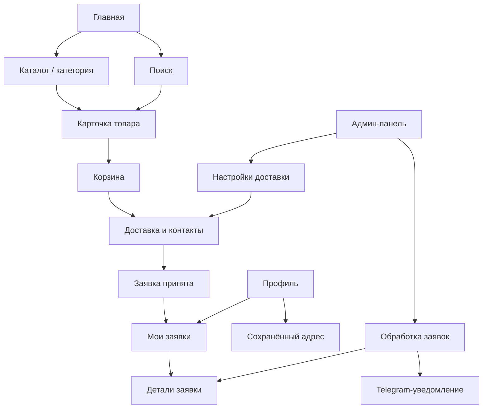

# SANPACK Storefront — UX Blueprint

Версия: 1.0, проект на утверждение
Дата: 2026-08-23
Статус: только проектирование; этот документ не разрешает менять витрину, backend, базу данных, Telegram-бота или админ-панель

## 1. Целевой результат

SANPACK должен стать спокойной, понятной и современной B2B-витриной, одинаково качественно работающей в трёх средах:

- полноценный сайт на компьютере;
- мобильный сайт;
- Telegram Mini App.

Логика взаимодействия должна быть знакома пользователю Яндекс Маркета, Лавки или Еды, но не терять B2B-сущность SANPACK: единицы продажи, минимальный заказ, упаковки, варианты, цены «по запросу» и подтверждение менеджером.

AllFoods используется только как ориентир по ритму, bento-категориям, быстрому добавлению и последовательности оформления. Копировать их бренд, оранжевую палитру и интерфейс один в один не нужно.

## 2. Зафиксированные решения

### Корзина и оформление

- В интерфейсе используется привычное слово **«Корзина»**.
- Финальная кнопка — **«Отправить заявку»**, а не «Оплатить» и не «Оформить заказ».
- До подтверждения менеджером сумма называется **«Предварительная сумма»**.
- Способ получения один — доставка. Самовывоза в этой версии нет.
- В блоке контактов только:
  - контактное лицо — обязательно;
  - телефон — обязательно.
- В блоке доставки:
  - адрес — обязательно;
  - дата — обязательно;
  - интервал времени — только если реальные интервалы настроены;
  - комментарий курьеру/менеджеру — необязательно.
- Название компании и ИНН не запрашиваются при оформлении.
- ИНН не входит в основной профиль первой версии. Если он понадобится позже, его можно спрятать в необязательный блок «Данные организации».
- Стоимость доставки не придумывается на клиенте. Она показывается только по правилам backend; если точного расчёта нет, интерфейс честно сообщает, что стоимость подтвердит менеджер.
- Онлайн-оплаты в этом этапе нет.

### Языки и товарные данные

- Русский, узбекский и английский — равноправные локали.
- Название товара, варианта, единица, характеристика, статус, ошибка и пустое состояние должны соответствовать выбранному языку.
- Отсутствующий перевод — проблема качества данных в админке, а не основание молча показывать русский текст в узбекской или английской версии.
- Идентификаторы, цены, количество, минимальный заказ и суммы остаются серверными, авторитетными данными.
- В заявке сохраняются снимки названий, варианта, единицы, цены и доставки. История не должна меняться после редактирования каталога.

### Платформы

- Мобильный сайт и Mini App используют одну адаптивную продуктовую систему.
- Telegram-интеграция — тонкий адаптер, а не отдельная копия сайта.
- Desktop получает собственную широкую композицию, а не растянутый мобильный экран.
- Ключевые экраны имеют URL/deep link. Возврат назад сохраняет поиск, фильтры и позицию прокрутки.

## 3. Принципы продукта

1. **Сначала каталог.** Короткий путь: категория/поиск → товар → корзина.
2. **Одно главное действие на экран.** Второстепенные кнопки не спорят с основным CTA.
3. **B2B-факты видны.** Минимум, единица продажи, упаковка, вариант и режим цены не прячутся ради декоративной простоты.
4. **Корзина всегда рядом.** На мобильном непустая корзина появляется компактной панелью над нижней навигацией.
5. **Постепенное раскрытие.** Пользователь видит только поля, нужные на текущем шаге.
6. **Никакой ложной точности.** Неизвестная цена товара или доставки отмечается «по запросу».
7. **Локализация по умолчанию.** Все состояния проверяются в RU/UZ/EN, включая длинные строки.
8. **Витрина и админка — одна система.** Каждое публичное поле имеет источник истины и одинаково читается в админке, истории, документах и уведомлении.

## 4. Карта системы



## 5. Утверждаемая карта экранов

| Экран | Рекомендуемый маршрут | Основная задача | Mobile / Mini App | Desktop |
|---|---|---|---|---|
| Главная | `/[locale]` | Вход в каталог | Bento-категории, товарные секции | Hero, широкое bento, товарные секции |
| Каталог | `/[locale]/catalog` | Все категории и товары | 2 колонки, фильтры в sheet | Навигация по категориям, 4 колонки |
| Категория | `/[locale]/catalog/[categorySlug]` | Узкий выбор | Контекст категории + сетка | Breadcrumbs, фильтры, сетка |
| Поиск | `/[locale]/search` | Подсказки и результаты | Отдельная верхнеуровневая вкладка | Поиск в шапке + страница результатов |
| Товар | `/[locale]/product/[productSlug]` | Решение и количество | Изображение, главное, sticky CTA | Галерея + данные + sticky-панель |
| Корзина | `/[locale]/cart` | Проверить состав | Товары сначала, CTA снизу | Товары слева, итог справа |
| Оформление | `/[locale]/checkout` | Доставка и контакты | Один последовательный столбец | Форма слева, итог справа |
| Успех | `/[locale]/checkout/success/[requestNumber]` | Подтвердить отправку | Номер, пояснение, ссылка в историю | Компактный центрированный блок |
| Мои заявки | `/[locale]/orders` | Текущие и прошлые заявки | Карточки со статусами | Фильтруемый список |
| Детали заявки | `/[locale]/orders/[requestNumber]` | Состав, сумма, доставка, статус | Вертикальная история | Двухколоночная детализация |
| Профиль | `/[locale]/profile` | Имя, телефон, адрес, язык | Простые секции-строки | Компактная форма настроек |
| Избранное | `/[locale]/favorites` | Сохранённые товары | Из профиля/меню | Из шапки и профиля |

### Совместимость маршрутов

- Существующий `/[locale]/request` нельзя ломать.
- После готовности нового потока он перенаправляется в `/[locale]/cart` или остаётся совместимым alias.
- Старые ссылки на каталог, товары и заявки сохраняются.

## 6. Навигация

### Mobile web и Telegram Mini App

Пять верхнеуровневых разделов:

1. Главная
2. Каталог
3. Поиск
4. Заявки
5. Профиль

Корзина не становится шестой вкладкой. Если в ней есть товары, над нижней навигацией появляется компактная панель с количеством и предварительной суммой. Избранное остаётся на карточках и доступно из профиля/меню.

Обязательные правила:

- учитывать нижнюю safe area и высоту Telegram/iOS chrome;
- не перекрывать последнюю карточку или CTA;
- у каждой вкладки есть иконка и видимая подпись;
- возврат восстанавливает прокрутку, запрос и фильтры;
- Telegram BackButton повторяет внутреннюю навигацию, но без SDK остаётся обычная веб-кнопка назад.

### Desktop

- В основной шапке: логотип, вход в каталог, широкий поиск, избранное, корзина и профиль.
- Корпоративные страницы остаются вторичной навигацией.
- Каталог использует широкую область под навигацию и 4-колоночную сетку.
- Оформление — два столбца со sticky-итогом, а не растянутая мобильная форма.

## 7. Главный пользовательский путь

1. Пользователь открывает Главную, Каталог или Поиск.
2. Выбирает категорию или вводит запрос.
3. На карточке видит изображение, локализованное название, режим цены, минимум и единицу продажи.
4. Быстрое добавление кладёт минимально допустимое количество либо открывает выбор варианта.
5. Панель корзины подтверждает добавление, не уводя из каталога.
6. В Корзине пользователь проверяет состав и количество.
7. В Оформлении вводит адрес, дату, при наличии интервал, контактное лицо, телефон и комментарий.
8. Сервер повторно проверяет товарные правила и рассчитывает предварительную сумму.
9. После отправки пользователь получает номер заявки.
10. Админка и Telegram получают один и тот же серверный снимок.

### Возвращающийся пользователь

- Telegram-авторизация или customer session подставляет имя, телефон и сохранённый адрес, если они есть.
- Значения можно изменить для конкретной заявки.
- В истории видны статус и прошлые обращения.
- Детали заявки читают сохранённые снимки, а не актуальную карточку товара.

### Ошибки и восстановление

- Изменившийся товар получает понятное пояснение и действия «обновить»/«удалить».
- Товар без известной цены остаётся допустимым и помечается «по запросу».
- При отсутствии дат показывается причина и контакт с менеджером.
- При сетевой ошибке черновик сохраняется и есть повторная отправка.
- Idempotency key защищает от дубля при двойном нажатии.

## 8. Структурные вайрфреймы

### Главная

Mobile/Mini App:

1. компактная фирменная шапка;
2. крупный вход в поиск;
3. bento-сетка категорий на спокойных пастельных фонах;
4. популярные/новые товары;
5. короткое подтверждение условий работы и доставки;
6. панель корзины, если она непустая;
7. нижняя навигация.

Desktop:

1. основная и вторичная навигация;
2. hero с прямым действием «Перейти в каталог»;
3. широкая bento-композиция категорий;
4. товарные блоки в 4 колонки;
5. преимущества и footer.

### Каталог и поиск

- На телефоне 2 колонки, не 3.
- На стандартном desktop 4 колонки; на небольшом ноутбуке 3.
- Изображение имеет зарезервированное соотношение сторон — без скачков верстки.
- Быстрое добавление визуально компактно, но touch target не меньше 44×44.
- Товар с обязательным вариантом открывает выбор и ничего не угадывает.
- Фильтр и сортировка — отдельные подписанные действия.
- Пустой результат предлагает очистить фильтры, перейти в категории или связаться с менеджером.

### Карточка товара

- Галерея и варианты используют один согласованный источник активного изображения.
- На mobile сначала: изображение, название, доступность/цена, минимум, количество, CTA.
- Ниже: описание, характеристики, доставка, документы.
- На desktop: галерея слева, информация по центру, панель заявки справа.
- При отсутствии фото используется локализованное спокойное сообщение, а не большой универсальный логотип-пакет.

### Корзина

- Состав товаров расположен раньше любых контактных полей.
- Строка показывает название/вариант, снимок изображения, цену или «по запросу», количество, сумму и удаление.
- При смешанных ценах объясняется, что сумма включает только известные позиции.
- Основной CTA — **«Перейти к доставке»**.
- Рекомендации идут после корзины, а не разрывают состав и итог.

### Оформление

Порядок блоков:

1. адрес доставки;
2. дата;
3. интервал — только если настроен;
4. контактное лицо и телефон;
5. комментарий;
6. итоговая проверка.

Единственный основной CTA — **«Отправить заявку»**. Рядом с **«Предварительной суммой»** указано, что менеджер подтвердит наличие, итоговую цену и доставку.

### Заявки и детали

- Пустое состояние ведёт в каталог.
- Карточка заявки показывает номер, дату, статус, количество позиций и предварительную сумму/«по запросу».
- Детали показывают timeline статуса, доставку, снимки товаров, суммы и связь с менеджером.
- Исторические данные не меняются вслед за каталогом.

### Профиль

Поля первой версии:

- Telegram/customer identity;
- контактное имя;
- телефон;
- адрес по умолчанию;
- язык интерфейса.

Организация и ИНН отложены в необязательное progressive disclosure и не мешают просмотру или отправке заявки.

## 9. Направление визуальной системы

### Шрифты

Рекомендуемая связка уже загружается проектом:

- **Manrope** — заголовки, навигация, кнопки, цены и важные значения;
- **Inter** — основной текст, подсказки форм, характеристики, длинные описания и насыщенные данными части админки;
- **MTS Wide/Text/Compact** — логотип, отдельные фирменные материалы и промо-графика, но не основной интерфейс витрины.

Это убирает излишне extended-ощущение без новой зависимости. Текущий вариант темы `modern` уже соответствует Manrope + Inter.

### Цвет и поверхности

- Основной цвет действий и доверия — фирменный зелёный SANPACK.
- Фон — тёплый почти белый; товарные поверхности — белые.
- Bento-категории получают спокойные пастельные оттенки, но товарные карточки не раскрашиваются все подряд.
- Красный — только ошибка/опасное действие; янтарный — предупреждение/ожидание.
- Сначала используются воздух и различие поверхностей, затем тонкая граница; тяжёлые тени — исключение.

### Форма, плотность, иконки

- Ритм отступов 4/8 px.
- Радиус контролов 12–14 px; карточек/панелей 16–18 px.
- Интерактивная высота минимум 44 px, основное действие оформления — 48 px.
- Одна линия Lucide outline-иконок, единая толщина штриха.
- Переходы 150–250 ms, только transform/opacity, поддержка reduced motion.
- Цены используют tabular figures.
- Длинные названия переносятся; важные сведения не существуют только в tooltip.

Результат локального UI/UX-поиска предложил bento и спокойную B2B-подачу, что подтверждает направление. Предложенные им generic navy и Atkinson Hyperlegible не принимаются: они разрушают уже существующий бренд SANPACK и добавляют ненужную шрифтовую зависимость.

## 10. Контракт backend и данных

Изменения должны быть аддитивными и не ломать старые заявки.

```text
contact
  name
  phone

delivery
  mode = delivery
  address
  dateISO
  windowId?
  windowLabelSnapshot?
  comment?
  feeMode = free | fixed | manager_quote
  feeAmount?
  ruleRevision?

pricing
  currency = UZS
  knownItemsSubtotal
  hasUnknownPriceItems
  deliveryFee?
  preliminaryTotal?

items[]
  product/variant identifiers
  localized title snapshots
  quantity and sales-unit snapshot
  price mode, unit price, line total
  image snapshot
```

Существующие верхнеуровневые поля можно читать во время перехода. Новый слой нормализации должен приводить старые и новые записи к одной view model.

### Серверные инварианты

- Браузеру нельзя доверять названия, цены, суммы и минимум.
- Перед созданием заявки сервер перечитывает опубликованные товары и варианты.
- Сохраняются RU/UZ/EN snapshots, уже предусмотренные текущей моделью.
- Сохраняется применённое правило/название интервала доставки, а не только ссылка на живые настройки.
- Один расчёт используется в success-экране, админке, документе и Telegram.
- Отправка идемпотентна.
- Черновик удаляется только после успешного ответа сервера.

## 11. Связь с админ-панелью

### Настройки доставки

Нужен отдельный ограниченный раздел:

- доставка включена;
- timezone проекта;
- минимальный lead time;
- горизонт доступных дат;
- рабочие дни и исключения;
- интервалы времени, если они реально существуют;
- порог бесплатной доставки;
- фиксированная цена либо режим «подтвердит менеджер»;
- локализованное публичное пояснение.

Если правило не настроено, витрина его не выдумывает.

### Обработка заявки

В деталях админ видит:

- контактное лицо и телефон;
- адрес, дату/интервал и комментарий;
- снимки товаров и цен;
- известный subtotal, признак неизвестных цен, режим доставки и предварительный итог;
- статус и audit trail;
- источник: web, mobile web или Telegram Mini App.

### Качество каталога

До публикации админка явно показывает недостающие RU/UZ/EN-поля. AI может помогать переводить, но результат проходит валидацию и проверку оператором. Публичный сайт не переводит данные в реальном времени.

## 12. Telegram и уведомления

Глубокая Mini App/бот-интеграция отложена, но новый контракт сразу учитывает её.

Итоговое уведомление о новой заявке должно содержать:

- номер и источник;
- имя и телефон;
- адрес, дату/интервал и комментарий;
- каждую позицию с количеством, ценой или «по запросу» и line total;
- предварительный subtotal, состояние доставки и предварительный итог;
- ссылку в админку, если она безопасно доступна.

Текущий order service уже сохраняет цену позиции, `lineTotal`, `subtotal` и `total`. Поэтому отсутствие суммы в Telegram — в основном пробел формата уведомления и тестов. Данные доставки потребуют аддитивного расширения checkout/schema.

## 13. Локализация

- Каждый новый ключ одновременно добавляется в RU, UZ и EN.
- По локали разрешаются товар, вариант, характеристика, единица, категория, статус, ошибка, документ и уведомление.
- Даты отображаются через locale-aware formatter; хранятся как однозначная ISO-дата в timezone проекта.
- Валюта форматируется одним каноническим модулем с согласованным `сум`/`so‘m`/`UZS`.
- Автотест обнаруживает пропущенный ключ и wrong-locale fallback на основных экранах.
- Узбекская капитализация хранится правильно в данных; CSS `text-transform: capitalize` не используется как исправление контента.

## 14. Доступность и производительность

- Контраст WCAG AA.
- Видимый focus и логичный tab order на desktop.
- Видимые label, inline error и путь восстановления у каждого поля.
- Touch area минимум 44×44 и расстояние минимум 8 px между соседними целями.
- Safe area для Telegram/iOS; контент не скрывается под sticky-блоками.
- Никаких emoji как системных иконок.
- `prefers-reduced-motion`.
- Responsive images с aspect ratio, корректным `sizes`, оптимизированным форматом и lazy loading ниже fold.
- Skeleton резервирует место и не создаёт CLS.
- Проверка 360, 375, 390, 768, 1024 и 1440 px плюс phone landscape.

## 15. План реализации

### Этап 0 — утверждение и инвентаризация

- Утвердить эту карту и терминологию.
- Утвердить модель цены доставки и наличие реальных временных интервалов.
- Инвентаризировать компоненты, маршруты, старые заявки, настройки и переводы.
- Зафиксировать исходные скриншоты и regression data.

Критерий выхода: нет нерешённого бизнес-правила, меняющего структуру checkout.

### Этап 1 — визуальный фундамент и адаптивная оболочка

- Сделать Manrope + Inter стандартом витрины, сохранив MTS для фирменных акцентов.
- Нормализовать tokens: type roles, отступы, радиусы, иконки, elevation, motion, focus.
- Собрать адаптивную desktop/mobile/TMA-навигацию и safe areas.
- Добавить визуальные regression targets.

Критерий выхода: оболочка работает в RU/UZ/EN, с клавиатурой, touch и с Telegram SDK/без него.

### Этап 2 — поиск, каталог и товар

- Доработать Home bento, Каталог, Поиск, карточки, фильтры и все loading/empty/error states.
- Доработать галерею, варианты, локализацию и состояние без фото.
- Сохранить текущие B2B-правила количества и режима цены.

Критерий выхода: любой опубликованный товар можно найти и корректно добавить во всех локалях.

### Этап 3 — корзина и checkout-контракт

- Разделить просмотр корзины и доставку/контакты.
- Добавить серверно валидируемую доставку, дату, контакт и комментарий.
- Добавить настройки доставки и snapshot-модель.
- Добавить idempotency и восстановление черновика.
- Сохранить совместимость `/request`.

Критерий выхода: одна заявка имеет одинаковое авторитетное содержание в storage, success и admin.

### Этап 4 — заявки, профиль, админка и Telegram parity

- Собрать список/детали заявок и лёгкий профиль.
- Расширить admin request detail и delivery settings.
- Добавить цены и доставку в Telegram-уведомление.
- Добавить локализованные статусы и mapping старых записей.

Критерий выхода: менеджер обрабатывает заявку без восстановления данных вручную.

### Этап 5 — Telegram Mini App polish

- Проверить safe areas, Telegram theme params, BackButton, auth restore и deep links.
- Добавлять Telegram-специфичные элементы только поверх общего потока.
- Сохранить полноценный browser fallback.

Критерий выхода: один сценарий проходит mobile web и Telegram acceptance tests.

### Этап 6 — выпуск

- Tests, typecheck, lint, build, accessibility, visual regression и cross-browser matrix.
- Read-only audit production data до миграции.
- Staged rollout, мониторинг и rollback plan.
- Никаких production writes/deploy без отдельного разрешения.

## 16. Критерии приёмки

### Mobile / Mini App

- Нет 3-колоночной товарной сетки.
- Пять подписанных пунктов нижней навигации.
- Непустая корзина доступна в одно касание и не перекрывает контент.
- Порядок: товары → доставка → контакты → проверка.
- Touch targets и safe area проходят проверку.

### Desktop

- Нет необъяснимой пустой полосы между контекстом каталога и товарами.
- Поиск и корзина доступны в шапке.
- Каталог использует широкий экран без чрезмерной длины строк.
- Sticky-итог не перекрывает форму.

### Backend / admin

- Старые заявки продолжают отображаться.
- Новые поля необязательны для legacy reader и обязательны/валидны для нового checkout.
- Клиентская цена не может изменить серверный итог.
- Админка, история, документ и Telegram согласованы.

### Локализация

- В RU/UZ/EN нет чужого языка в названиях и интерфейсных подписях основного пути.
- Единицы и регистр корректны по данным и локали.
- Пропущенный перевод блокируется admin QA, а не маскируется русским fallback.

## 17. Что намеренно не входит в ближайший этап

- копирование бренда и оранжевой палитры AllFoods;
- замена текстового wordmark в PDF-каталоге на официальный фирменный логотип SANPACK — отдельная отложенная задача после основного storefront-этапа;
- онлайн-оплата;
- самовывоз;
- обязательная компания/ИНН;
- cashback, loyalty и service fee из референса;
- runtime AI-перевод публичной витрины;
- отдельная дублирующая кодовая база Mini App;
- production deploy, production writes и массовая миграция без отдельного review.

## 18. Четыре пункта на утверждение

1. Карта экранов и нижняя навигация: Главная, Каталог, Поиск, Заявки, Профиль.
2. Политика доставки: бесплатно/фиксированно/подтверждает менеджер и поведение текущего порога бесплатной доставки.
3. Существуют ли реальные интервалы доставки; если нет — оставляем только дату.
4. Manrope + Inter как интерфейс витрины; MTS — только фирменные акценты.

После утверждения этих четырёх пунктов можно начинать Этап 1, не меняя преждевременно checkout schema.
